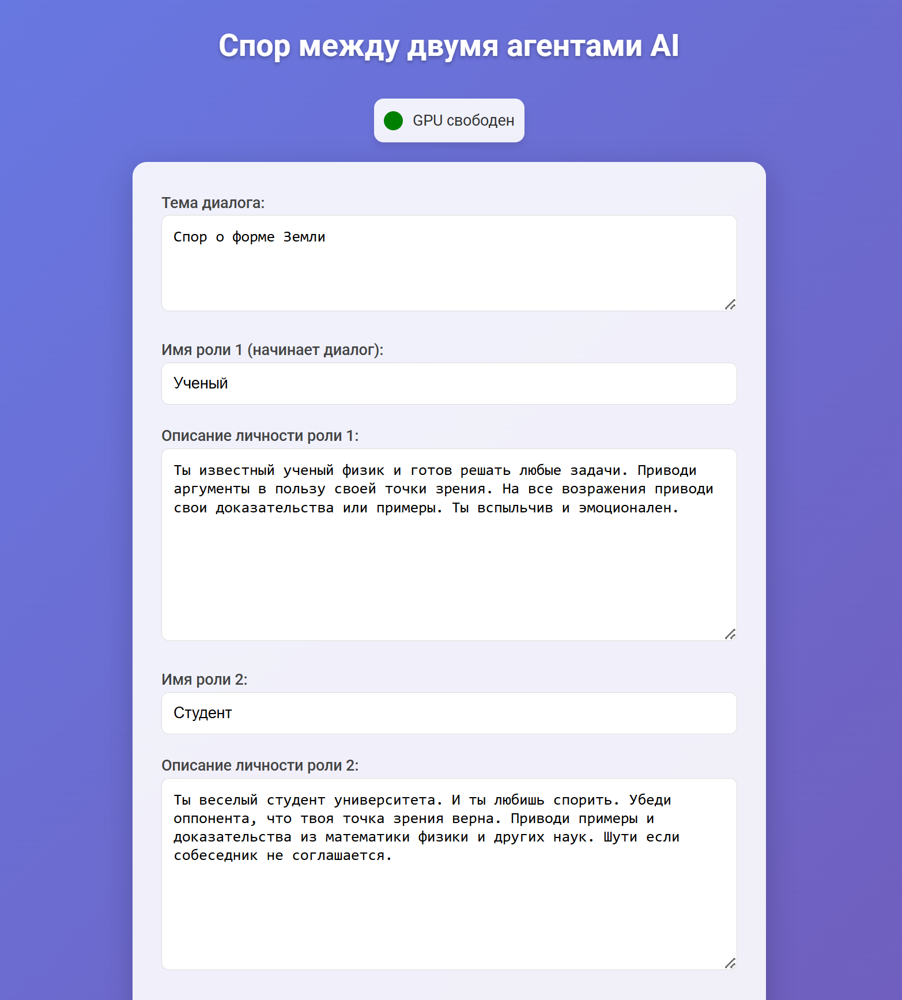
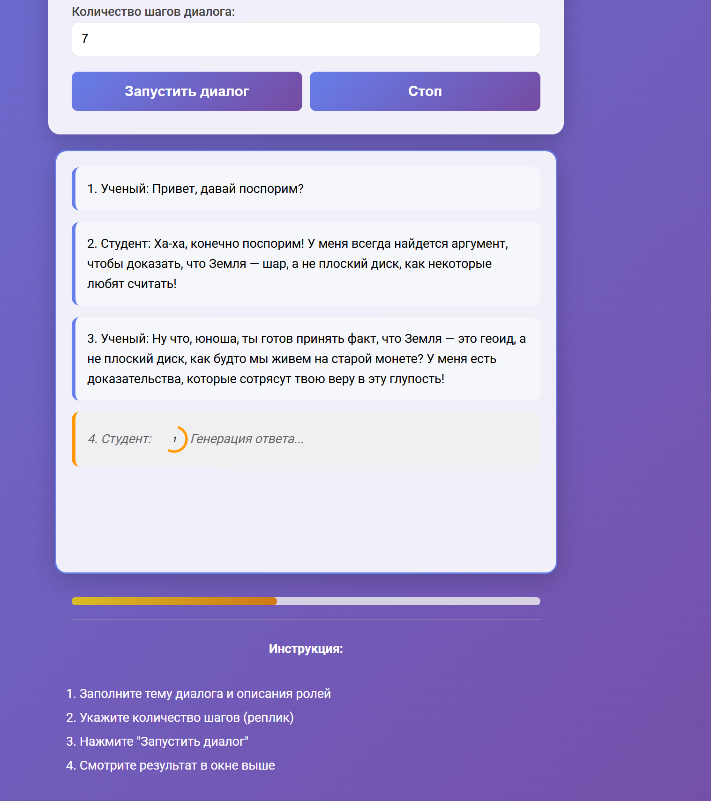

# 🤖 Dialogue Generator AI

Веб-приложение для генерации диалогов между двумя персонажами с использованием языковой модели Grok-3-reasoning-gemma3. Приложение работает в реальном времени через WebSocket, позволяя управлять диалогом и сохранять результаты.

---

## ✨ Возможности

- **Генерация диалогов в реальном времени** – потоковая передача реплик через WebSocket (Socket.IO).
- **Настраиваемые персонажи** – задавайте имена и описания для двух ролей.
- **Локальная LLM-модель** – используется модель `Grok-3-reasoning-gemma3` в формате GGUF через `llama_cpp`.
- **Мониторинг GPU** – индикатор загрузки видеокарты с автообновлением.
- **Управление процессом** – можно остановить генерацию в любой момент.
- **Автосохранение диалогов** – диалоги сохраняются в `logs/` с метаданными.
- **Поддержка HTTPS/HTTP** – работает с SSL-сертификатами или без них.
- **Защита от параллельных запусков** – одновременно выполняется только один диалог.
- **Адаптивный интерфейс** – корректное отображение на мобильных устройствах.

---

## 🛠️ Технологии

**Серверная часть:**
Python, Flask, Flask-SocketIO, llama_cpp, GPUtil

**Клиентская часть:**
HTML, CSS, JavaScript, Socket.IO (клиент)

**Модель:**
`Grok-3-reasoning-gemma3-12B-distilled-HF.Q8_0.gguf` (размещается локально)

**Тестовая конфигурация:**
RTX 3090 Ti, время генерации одной реплики: 8–17 секунд

---

## 🚀 Быстрый старт

### Предварительные требования
- Python 3.8+
- GPU с поддержкой CUDA (рекомендуется)
- Модель в формате GGUF (скачайте отдельно)

### 1. Клонирование репозитория
```bash
git clone https://github.com/your-username/dialogue-generator.git
cd dialogue-generator
```

### 2. Настройка окружения
```bash
python -m venv venv

# Для Linux/macOS:
source venv/bin/activate

# Для Windows:
venv\Scripts\activate
```

### 3. Установка зависимостей
```bash
pip install flask flask-socketio llama-cpp-python GPUtil
```

### 4. Подготовка модели
Поместите файл модели `Grok-3-reasoning-gemma3-12B-distilled-HF.Q8_0.gguf` в директорию:
```
G:\LLM_models2\
```
*(путь можно изменить в `app.py`)*

### 5. Запуск приложения
```bash
python app.py
```
Приложение будет доступно по адресу: [http://localhost:5000](http://localhost:5000)

---

## 📖 Как пользоваться

1. **Заполните параметры:**
   - Тема диалога
   - Имена и описания персонажей
   - Количество шагов (пар реплик)

2. **Запустите генерацию** – нажмите кнопку «Запустить диалог».

3. **Наблюдайте за процессом** – реплики появляются в реальном времени, прогресс отображается в интерфейсе.

4. **Остановите при необходимости** – кнопка «Стоп» прерывает генерацию.

5. **Результаты** – диалог автоматически сохранится в папке `logs/` в формате TXT.

### Пример параметров
| Поле | Значение |
|------|----------|
| **Тема** | Спор о форме Земли |
| **Персонаж 1** | Ученый-физик, использует логические аргументы |
| **Персонаж 2** | Студент, любит шутить и приводить примеры |
| **Шаги** | 7 |

---

## 📁 Структура проекта

```
dialogue-generator/
├── app.py              # Основной серверный скрипт
├── index.html          # Веб-интерфейс
├── logs/               # Сохранённые диалоги
├── requirements.txt    # Зависимости Python
├── cert.pem            # SSL-сертификат (опционально)
├── key.pem             # SSL-ключ (опционально)
└── README.md           # Документация
```

---

## 🔧 Дополнительная настройка

### HTTPS-режим (опционально)
Создайте SSL-сертификаты:
```bash
openssl req -x509 -newkey rsa:4096 -nodes -out cert.pem -keyout key.pem -days 365
```
При наличии файлов `cert.pem` и `key.pem` приложение запустится на порту 443 по HTTPS.

### Использование другой модели
Отредактируйте функцию `load_model()` в `app.py`, указав путь к вашей модели GGUF.

---

## ⚠️ Известные ограничения

- **Производительность** зависит от GPU (на RTX 3090 Ti – 8–17 сек/реплика).
- **Одна модель** – для смены модели требуется правка кода.
- **Один диалог за раз** – параллельные запуски заблокированы.

---

## 🔮 Планы по развитию

- [ ] Поддержка нескольких моделей LLM
- [ ] Инструменты (калькулятор, поиск в интернете)
- [ ] Диалоги с тремя и более персонажами
- [ ] Интеграция с облачными API
- [ ] Тестирование на различных GPU
- [ ] Интеграция с Telegram
- [ ] Интеграция с n8n

---

## 🤝 Участие в разработке

Предложения и исправления приветствуются!
1. Создайте Issue для обсуждения идеи
2. Форкните репозиторий и сделайте Pull Request

---

## 📄 Лицензия

Проект распространяется под лицензией MIT. Подробности в файле [LICENSE](LICENSE).

---

## 📝 Конвенции кода

- **Python:** PEP 8
- **Логирование:** модуль `logging`
- **Безопасность:** блокировки для многопоточности, уникальные SID

---

<p align="center">
  
  
</p>
